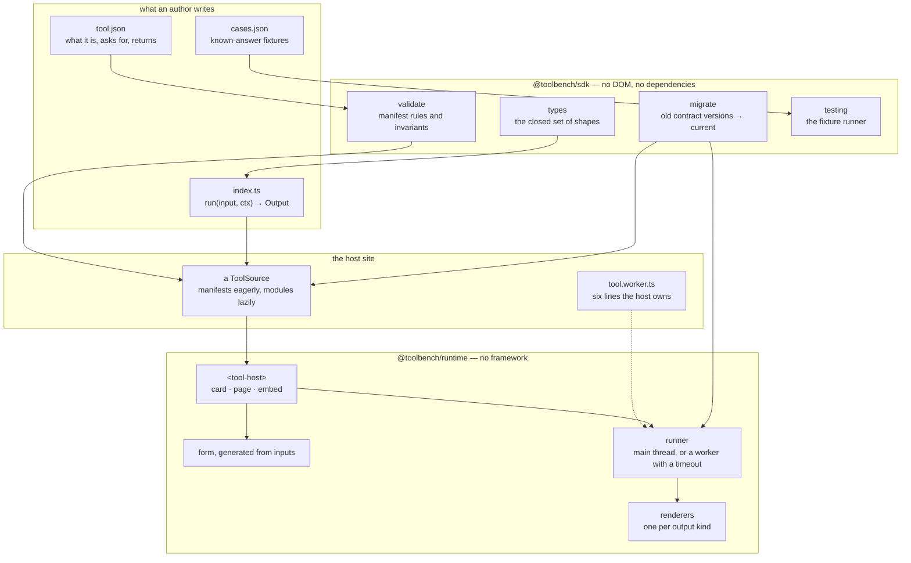

# Architecture

How the pieces fit, and why each boundary is where it is.

## The shape



## Why the SDK has no DOM

A tool's correctness has nothing to do with a browser. Keeping the contract DOM-free buys three
things at once: fixtures run in Node in milliseconds, a host can run a tool at *build* time to
pre-render a result, and a tool can run inside a worker — which has no DOM at all. Any one of those
would justify it; together they make it non-negotiable.

The consequence for tools that need to *draw* something is that computation and drawing separate:
`run` returns data, and a future contract version will add a drawing kind whose renderer lives in the
runtime. A tool never ships a component.

## Why the runtime is a custom element

A custom element is the only component model every website already has. `<tool-host>` works in Astro,
Next, WordPress, a static HTML file and anything else, with no framework and no build step required of
the host. Choosing a framework would have made the runtime smaller to write and useless to anyone not
already using that framework.

The shadow root follows from it: the host's CSS cannot reach in and break a tool, our CSS cannot leak
out and break the host, and theming becomes an explicit list of custom properties rather than a
selector war.

## Why manifests and modules load differently

A manifest is **data**: it can be fetched, listed, filtered, and rendered into a card with no
behaviour at all. A module is **code**: on a static site there is no way to fetch and run code without
`eval`, which would mean no bundling, no tree-shaking, and giving up a Content-Security-Policy worth
having.

So the split is structural. A `ToolSource` may resolve *metadata* however it likes — a bundler glob, a
JSON file, an HTTP call — but the *module* must be something the bundler saw. A source backed by a
remote repository therefore works by generating a registry at build time, not by fetching JavaScript
in a reader's browser.

This is also why the worker's loader lives in the host (`bench/src/tool.worker.ts`, six lines): only
the host's bundler can resolve the host's tools.

## Why the main thread is the default

```
                      main thread        worker
cost to start         none               ~2 ms
can be timed out      no                 yes
can hold the page     yes                no
```

A worker cannot be a security boundary for code you wrote yourself and bundled yourself. What it can
do is let a tool be *stopped*, which matters only when the tool's running time depends on its input.
So that is exactly when a tool declares `thread: "worker"` — and the manifest rejects `timeoutMs` on
the main thread, because there is nothing there to terminate and a field that cannot do what it says
is worse than no field.

## The pieces that exist because something went wrong

Each of these was added after a failure, and each is guarded by a test:

| Guard | The failure it came from |
|---|---|
| Progress frames are dropped once a run settles | A throttled frame landed *after* the final result and overwrote it. The chart appeared for one frame and vanished. |
| `const _exhaustive: never` in the render dispatcher | Adding an output kind to the SDK without a renderer would have shown readers a blank space. Now it fails to compile. |
| Sequence numbers on every run, superseded runs rejected | Typing quickly let an older, slower answer arrive last and win. |
| A `worker.onerror` handler | A worker that fails to *start* — a missing chunk, a blocked script — otherwise leaves a spinner forever. |
| Terminate **and discard** the worker on timeout | A terminated worker's state is undefined; reusing it means reasoning about what survived. Respawning costs 2 ms. |
| `runner.dispose()` on element removal | On a site with client-side navigation the element is removed rather than the page reloaded, and a worker with no owner survives at a few megabytes each. |
| Fields identified by *group + label* in fixtures | A tool reporting the same quantity two ways ("time in system" under Formula and under Simulation) tripped a duplicate-label check that was not a duplicate. |
| The stress fixture's loop does real work | An empty timing loop was **deleted by the minifier** as dead code, so the tool returned instantly and the timeout test passed for the wrong reason. Only visible because the tests run against the built bundle. |

## Testing layers

| Layer | Runs | Covers |
|---|---|---|
| `packages/sdk/src/*.test.ts` | Node | Manifest validation and its invariants, the migration chain, fixture matching including its guard rails |
| `tools/cases.test.ts` | Node | Every tool's manifest and fixtures. Walks the directory, so a new tool is covered automatically |
| `tools/*/‌*.test.ts` | Node | A tool's own properties — for the queue explorer, that its simulation converges on the closed form |
| `bench/bench.test.ts` | Chrome, against the **built** bench | Everything a unit test cannot see: shadow DOM, lazy chunks, workers, timeouts, crashes, accessibility wiring, theming |

The last row is deliberately weighted towards failure paths, because those are the parts a demo never
exercises and a reader always finds.
